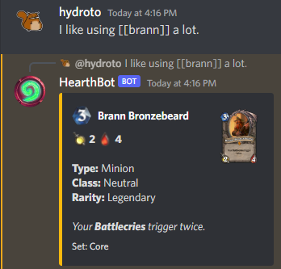
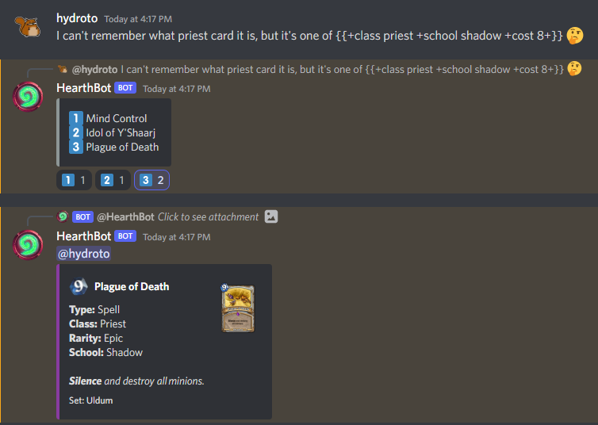
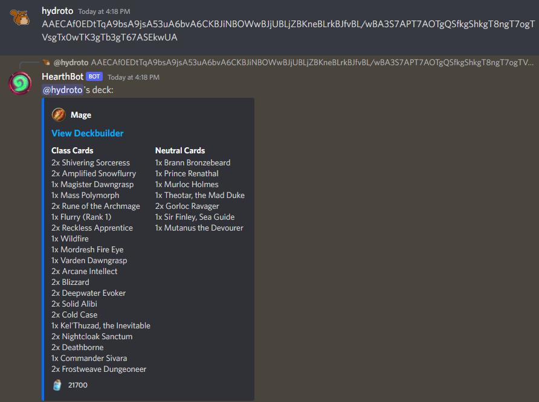
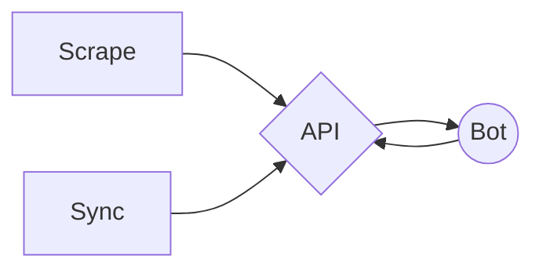

<p align="center">
  
</p>

<p align="center">
  Hearthbot is a bot for Discord that aids in conversation between Hearthstone players. By combining multiple data sources, the Hearthbot API has the most up-to-date card data, including unreleased cards. 
</p>

<p align="center">
  <sub>
    Data within this API is Copyright © Blizzard Entertainment - All Rights Reserved<br/>
    This project is not affiliated with Blizzard Entertainment.
  </sub>
</p>

## Usage

| Full          | Short | Description |
|---------------|-------|-------------|
| `+attack`     | `+a` | The attack of a card |
| `+class`      | `+c` | The class of a card |
| `+cost`       | `+o` | The cost of a card |
| `+durability` | `+d` | The durability of a *weapon* |
| `+health`     | `+h` | The health of a *minion* |
| `+locale`     | `+g` | Display *named* card information in a given locale (see available [here](packages/sync/src/constants.ts#L4)) |
| `+mechanic`   | `+m` | The mechanic of a *minion*, can specify multiple items |
| `+rarity`     | `+r` | The rarity of a card |
| `+set`        | `+s` | The set of a card, using shortnames (like TGT) or partial (Ungoro) |
| `+school`     | `+l` | The school of a *spell* |
| `+token`      | `+k` | Search token cards |
| `+tribe`      | `+t` | The tribe of a *minion* |
| `+type`       | `+y` | The type of a card (minion, spell, echantment, etc.) |

Cards relating to numbers (attack, cost, etc) can use ranges. These are all valid options:
- `+attack 5-8` - Gets cards with attack that are 5, 6, 7, or 8
- `+cost 3+` - Gets cards that cost three or more
- `+heatlh -5` - Gets cards that cost 5 or less
- `+durability 3` - Gets cards that have exactly 3 durability

### Named

By simply searching for the name of the card, Hearthbot will post the card details following your message.

Using square brackets (`[[ brann ]]`), the first card that matches your criteria will be posted. 

#### Examples
```
[[ ysera +s dragons ]] -> Ysera, Unleashed
[[ ghoul +r rare +a 3+ +h 0-3 ]] -> Happy Ghoul
[[flurry rank 2 +k]] -> Show the token card for the second rank of Flurry
```



### Search

If you can't remember exactly which card it is, or there's multiple with the same name, you can use the search functionality.

Using curly braces (`{{ brann }}`), the first 9 cards matching yoru criteria will be listed. From here, you can react with the correct emoji to post the card.

#### Examples

```
{{ ysera }} -> Lists all cards with "Ysera" in the name
{{ +m battlecry +m poisonous }} -> Lists all cards with both Battlecry AND Poisonous
{{ +c paladin +m rush +a 7+}} -> Lists all Paladin cards with Rush and 7 or more attack
```



### Decks

Deck codes are often shared, and Hearthbot supports displaying deck contents within Discord. 
Just post your deck code and Hearthbot will do the rest.

#### Examples



## Packages

| Name      | Description |
|----------------|-------|
| [API](/packages/api/)        | The GraphQL API that backs the project |
| [Bot](/packages/bot/)        | The Discord.js bot that users interact with |
| [Scrape](/packages/scrape/)  | The cron job that scrapes new card sets from hearthstonetopdecks.com |
| [Sync](/packages/sync/)      | The cron job that syncs data from hearthstonejson.com |



## Setup
Note: each service (besides the API) requires API credentials. You can read more about the `createUser` mutation in the [API docs](/packages/api#user).

### [API](/packages/api/)
```
$ sudo apt install mysql-server
$ sudo mysql_secure_installation
$ sudo mysql
> CREATE DATABASE hearthbot;
> exit;
$ cd packages/api
$ yarn install
$ cp .env.example .env
```

After mysql is installed and the `.env` is copied, fill out the information in `.env`.
Then run:
```
yarn dev
```

### [Bot](/packages/bot/)

```
$ cd packages/bot
$ yarn install
$ cp .env.example .env # fill in .env before continuing
$ yarn dev
```

### [Scrape](/packages/scrape/)

```
$ cd packages/scrape
$ yarn install
$ cp .env.example .env # fill in .env before continuing
$ yarn dev
```

### [Sync](/packages/sync/)

```
$ cd packages/sync
$ yarn install
$ cp .env.example .env # fill in .env before continuing
$ yarn dev
```

## Where can I help?

I'm always looking for ideas and contributions! If there's something you believe is worth adding, feel free to open a PR.

A few immediate things that could be taken care of:

1. Testing - jest is all set up, just need to add tests
2. Common code - `logging.ts` and `api.ts` within each package needs to be pulled out into a common package.
3. Bot README.md
4. Scrape README.md
5. Sync README.md

<p align="center">
  <a href="https://www.buymeacoffee.com/hydroto">
    
  </a>
</p>