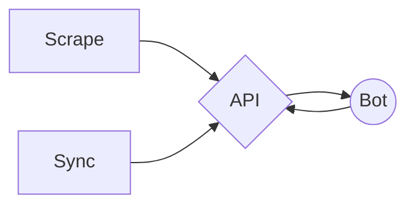

<p align="center">
  
</p>

<p align="center">
  Hearthbot is a bot for Discord that aids in conversation between Hearthstone players. By combining multiple data sources, the Hearthbot API has the most up-to-date card data, including unreleased cards. 
</p>

## Packages

| Name      | Description |
|----------------|-------|
| API     | The GraphQL API that backs the project |
| Bot     | The Discord.js bot that users interact with |
| Scrape  | The cron job that scrapes new card sets from hearthstonetopdecks.com |
| Sync    | The cron job that syncs data from hearthstonejson.com |



## Setup
Note: each service (besides the API) requires API credentials. You can read more about the `createUser` mutation in the [API docs](TODO).

### API
```
$ sudo apt install mysql-server
$ sudo mysql_secure_installation
$ sudo mysql
> CREATE DATABASE hearthbot;
> exit;
$ cd packages/api
$ yarn install
$ cp .env.example .env
```

After mysql is installed and the `.env` is copied, fill out the information in `.env`.
Then run:
```
yarn dev
```

### Bot

```
$ cd packages/bot
$ yarn install
$ cp .env.example .env # fill in .env before continuing
$ yarn dev
```

### Scrape

```
$ cd packages/scrape
$ yarn install
$ cp .env.example .env # fill in .env before continuing
$ yarn dev
```

### Sync

```
$ cd packages/sync
$ yarn install
$ cp .env.example .env # fill in .env before continuing
$ yarn dev
```

## Information

<p align="center">
  <a href="https://www.buymeacoffee.com/hydroto">
    
  </a>
</p>